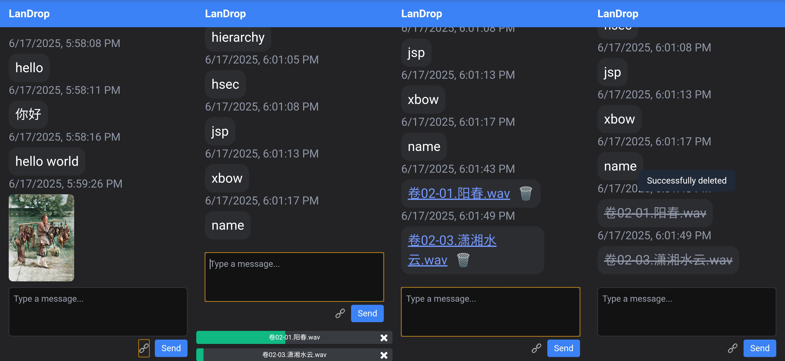

# LANDrop

中文 | [English](docs/README_EN.md)  

<details>
<summary>目录</summary>

- [LANDrop](#LANDrop)
  - [需求分析](#需求分析)
  - [关键词](#关键词)
  - [关键特性](#关键特性)
  - [技术栈](#技术栈)
  - [本地化安装和运行](#本地化安装和运行)

</details>

## 需求分析

需求分析：我需要一个简便的局域网消息传输应用，无需帐号登录步骤，可以在多台设备间传输文本、图片和文件，并且可以翻阅历史传输记录。

---
* `微信`、`QQ`、`Rocket.Chat` 这类即时通讯工具需要在两台设备同时登录，而登录的步骤在这种需求下是多余的
* 类似 `LocalSend` 的文件传输工具主要以文件传输功能为主，传输文本消息不方便
* 小工具 `Kouchat` 支持跨平台，可惜功能太简洁，不能传图片和文件，也不保存历史消息
* 用 `邮件` 在两台设备间传输信息也挺快，但步骤稍微有点多
* 最接近这个需求的就是 `Microsoft Edge Drop`，但有时加载很慢。如果有一个类似的应用能在局域网中部署就更好了，所以我写了这个 `LANDrop`

## 关键词

* **即时通讯**
* **匿名聊天室**
* **在线网页聊天**
* **Lan(局域网)**
* **跨平台**
* **本地化**

## 关键特性

**无需帐号登录**

**在本地进行文本，图片和文件的传输**

**保存历史传输记录**

**图片预览**

**多文件上传和文件删除**

---


## 技术栈

**[Expressjs](https://expressjs.com/)** - Fast, unopinionated, minimalist web framework for Node.js

**[Socket.io](https://socket.io/)** - Bidirectional and low-latency communication for every platform

**[TailwindCSS](https://tailwindcss.com/)** - Utility-first CSS framework

**[Sqlite](https://sqlite.org/)** - SQLite is a C-language library that implements a small, fast, self-contained, high-reliability, full-featured, SQL database engine.

## 本地化安装和运行

1. 安装 NodeJs (推荐使用 nvm)
2. 进入项目路径，运行 `npm install --save-dir`
3. 修改配置文件 `config.json`：
```json
{
  "uploadDir": "c:/LANDrop/uploads",
  "dbPath": "c:/LANDrop/chat.db",
  "port": 33000,
  "pageSize": 10
}
```
4. 运行应用 `npm start` 或者 `npm run dev`
5. 你可以把这个应用注册成服务。例如在`Windows`操作系统，可以很方便地通过[NSSM](https://nssm.cc/)来实现服务注册 `nssm install MyNodeApp "cmd.exe" /c "cd /d C:\myapp && npm start"`