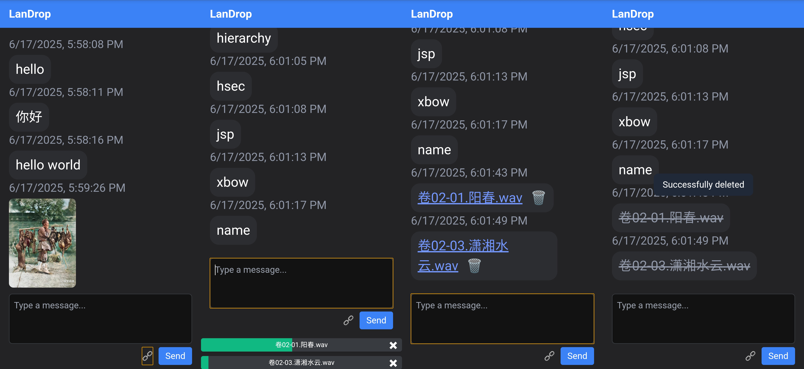

# LANDrop

[中文](../README.md) | English

<details>
<summary>Table of Contents</summary>

* [LANDrop](#LANDrop)

  * [Requirement Analysis](#requirement-analysis)
  * [Keywords](#keywords)
  * [Key Features](#key-features)
  * [Tech Stack](#tech-stack)
  * [Installation & Local Run](#installation--local-run)

</details>

## Requirement Analysis

I need a lightweight LAN-based messaging application that doesn't require account login. It should allow transmission of text, images, and files across multiple devices and support browsing of historical transfer records.

---

* Apps like **WeChat**, **QQ**, or **Rocket.Chat** require simultaneous login on both devices, which is unnecessary for this scenario.
* File transfer tools like **LocalSend** mainly focus on file transfers and are not convenient for sending text messages.
* Lightweight tools like **Kouchat** are cross-platform but too simplistic — they don’t support images or file transmission, and don’t keep message history.
* **Email** can also be used to transfer information between two devices, but it's a bit more cumbersome.
* The closest existing solution is **Microsoft Edge Drop**, but it sometimes loads slowly. A similar tool that can be deployed on the local network would be ideal — hence I developed **LANDrop**.

## Keywords

* **Instant Messaging**
* **Anonymous Chatroom**
* **Web-based Chat**
* **LAN (Local Area Network)**
* **Cross-platform**
* **Self-hosted**

## Key Features

**No required for Login step**

**Local transmission of text, images, and files**

**Preserves history of transferred content**

**Image Preview**

**Multi-file Upload and File Deletion**

---



## Tech Stack

**[Expressjs](https://expressjs.com/)** – Fast, unopinionated, minimalist web framework for Node.js

**[Socket.io](https://socket.io/)** – Bidirectional and low-latency communication for every platform

**[TailwindCSS](https://tailwindcss.com/)** – Utility-first CSS framework

**[Sqlite](https://sqlite.org/)** – SQLite is a C-language library that implements a small, fast, self-contained, high-reliability, full-featured SQL database engine.

## Installation & Local Run

1. Install Node.js (nvm is recommended)
2. Navigate to the project directory and run:

   ```bash
   npm install --save-dir
   ```
3. Edit the configuration file `config.json`:

   ```json
   {
     "uploadDir": "c:/LANDrop/uploads",
     "dbPath": "c:/LANDrop/chat.db",
     "port": 33000,
     "pageSize": 10
   }
   ```
4. Start the application:

   ```bash
   npm start
   ```

   or for development mode:

   ```bash
   npm run dev
   ```
5. You can register the app as a system service.
   For example, on **Windows**, you can easily register it using [NSSM](https://nssm.cc/):

   ```bat
   nssm install MyNodeApp "cmd.exe" /c "cd /d C:\myapp && npm start"
   ```

---
